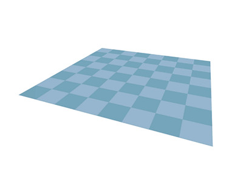
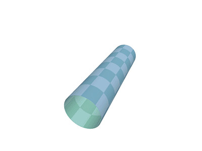
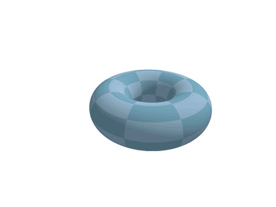

<!-- Project name and logo -->
# Interstellar Courier

*[Download](TODO) from GitHub.*

<!-- List of all contributors and their contribution -->
**Brian Confessor** - Lead Audio

**Benedict Henshaw** - Lead Designer

**Bashar Saade** - Lead Programmer

---

<!-- The game synopsis -->
## Synopsis

*Tower defence in 3D space on the surface on a torus.*

While the game borrows largely from other games in the tower defence genre, (specifically those in 3D: [Orcs Must Die](http://en.omd.gameforge.com/), [Atom Zombie Smasher](http://blendogames.com/atomzombiesmasher/)) those games generally operate on a 2D plane; the enemies are restricted to movement along a flat surface. Interstellar Courier's gameplay occurs on the surface of a torus; meaning a turret can project an object to an opposing side of the surface on which enemies move, causing the player to think about turret placement in real 3D space.

---

<!-- Player profile. -->
## Player profile

---

<!--
The context of your project.
How does your game fit into the larger industry?
Why is it different or more unique that other, similar games?
-->
## Industry

---

<!-- Challenge you faced and overcome -->
## Challenges

#### Path finding
One of the reasons why we arrived at a torus was that path finding on it's surface is relatively simple. The map of a torus is a (slightly stretched) grid, meaning common path finding algorithms (e.g. Dijkstra's Algorithm) can operate on it without modification.

#### Understanding the effects of using a torus as a play surface
When looking at the variations of torus, we recognised some interesting properties:

+ The ratio of the radii of the cross section and the overall torus affects the visibility of a turret built on the inside of the torus verses the outside. Just like how radio towers need to be built very tall to negate effects of the Earth's curvature, the effectiveness of turrets depend greatly on the shape's curvature and their own height.

+ This ratio also affects the how stretched the turret placement grid is. A thick torus with a small overall radius will have smaller grid squares on the inside of the torus, and larger grid squares on the outside of the torus. One could subdivide the larger squares if they are beyond a certain threshold, but the grid will be deformed in a ways that make path finding difficult.

---

<!-- Next steps -->
## Next steps

+ Progression in equipment, turret upgrades.
+ Variations in enemy types.
+ Increasing difficulty over time.
+ More and varied turret types.
+ Shapes other than a torus; inside of a sphere perhaps?
